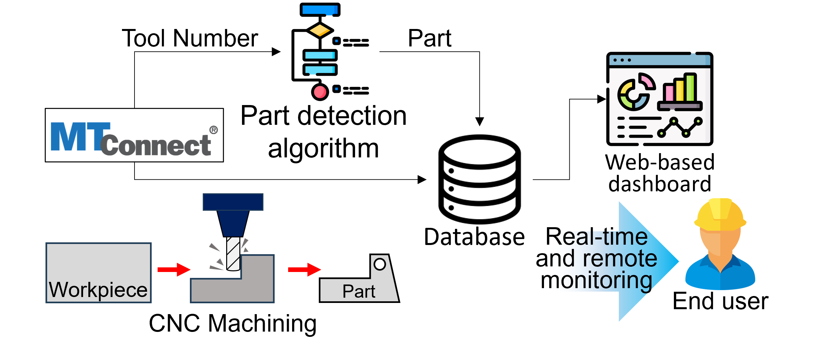
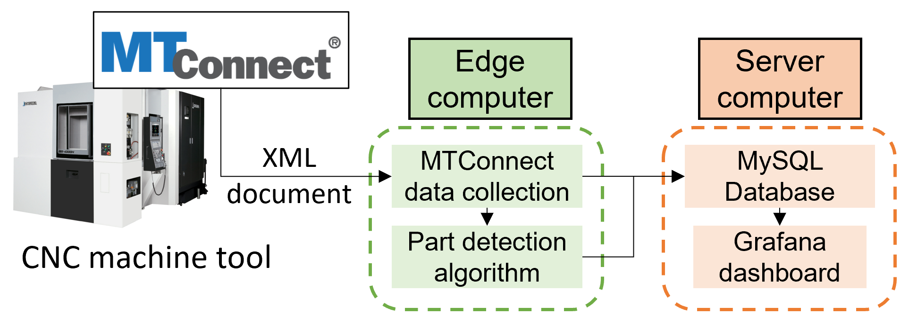
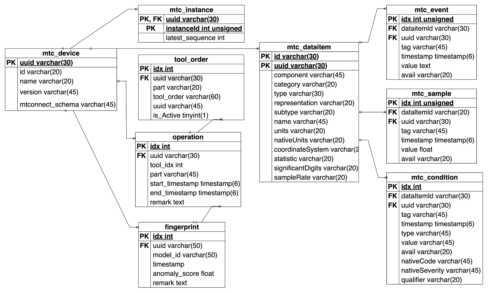
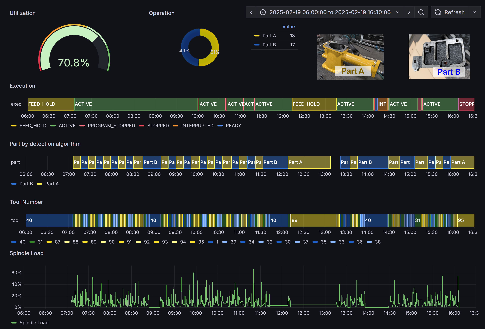

# mtconnect_part_detection
This Github Repository ([https://github.com/ManuFutureToday/mtconnect_part_detection](https://github.com/ManuFutureToday/mtconnect_part_detection)) serves as a public repository of MySQL database schema and part detection algorithm using MTConnect for CNC machine tool monitoring.

This repository provides MySQL database schema creation file and tool order-based part detection algorithm code.

<p align="center" id="figure-1">
   
</p> 

<p align="center">
Outline of real-time CNC machine tool monitoring using MTConnect and part detection algorithm
</p>

## System Architecture Overview

<p align="center" id="figure-2">
   
</p> 

<p align="center">
Data pipeline and system architecture overview
</p>

The figure illustrates the overall architecture of the MTConnect-based data monitoring and part detection system.

- **CNC Machine Tool**:
  - The system begins with an MTConnect-equpped CNC machine tool that exposes its operational data in the form of standardized XMl documents.
- **Edge computer**:
  - Located near the machine, edge computer is responsible for:
    - **MTConnect Data Collection**: Periodically polling the machine's MTConnect agent to retrieve real-time data stream (Samples, Event, Conditions).
    - **Part Detection Algorithm**: Analyzing collected data (e.g. tool order) to detect individual machining operations and associate them with specific parts.
- **Server Computer**:
  - A centralized server stores and visualizes the collected data:
    - **MySQL Database**: Receives structured MTConnect data and part detection restuls for long-term storage and querying.
    - **Grafana Dashboard**: Provides real-time monitoring and visualization of machine status and part operations.

This architecture ensures scalability, real-time monitoring, and data-driven analysis in discrete manufacturing environments by combining edge computing and centralized dashboards.

# Content

- [mtconnect\_part\_detection](#mtconnect_part_detection)
  - [System Architecture Overview](#system-architecture-overview)
- [Content](#content)
- [MySQL Database Schema for MTConnect](#mysql-database-schema-for-mtconnect)
    - [How to Use](#how-to-use)
- [MTConnect Data Collection to MySQL DB](#mtconnect-data-collection-to-mysql-db)
    - [How to Use](#how-to-use-1)
    - [Configuration Notes](#configuration-notes)
    - [Continuous Logging](#continuous-logging)
- [Part Detection Algorithm Based on Tool Order](#part-detection-algorithm-based-on-tool-order)
- [Example of Grafana Dashboard](#example-of-grafana-dashboard)

# MySQL Database Schema for MTConnect

The database schema is designed to be scalable across multiple machine equipped with MTConnect agents. Each table plays a role in enabling reliable, structured, and anlyzable MTConnect data logging.

<p align="center" id="figure-3">
   
</p> 

<p align="center">
MySQL DB Schema ERD for MTConnect
</p>

The provided Entity-Relationship Diagram (ERD) defines a relational schema designed for logging MTConnect streams, tool orders, machine operations, and part-lelevel signal fingerprints.

### How to Use

to setup database:

```bash
mysql -u [user] -p < mtc_db.sql
```

Replace `[user]` with your MySQL credentials. Or, you can also use a MySQL tool (e.g., [MySQL Workbench](https://www.mysql.com/products/workbench/), [HeidiSQL](https://www.heidisql.com/), etc.). 

By default, the database name is set to `factory` in the `mtc_db.sql` file.

If you wish to use a different name, you can open the SQL file in a text editor and replace all instances of `factory` with your preferred database name before executing the script.

 The `mtc_db.sql` file will initialize all tables as shown in the ERD.

<!-- This is comment -->


| Table           | Description |
| --------------- | ----------- |
| `mtc_device`    | Stores MTConnect device information retrieved from each agent. The `uuid` field enables filtering and management of data by device, making the schema scalable for multiple machines. |
| `mtc_dataitem`  | Contains MTConnect information model definitions as described in the agent's `devices.xml`. Each `dataItem` corresponds to a sensor or signal stream available on the machine.|
| `mtc_instance`  | Tracks the instance ID of the MTConnect agent. This allows continuous data logging even after agent restarts or network failures that reset the agent’s buffer.|
| `mtc_sample`    | Stores time-series **Sample** data (e.g., spindle speed, feed rate) from MTConnect streams. |
| `mtc_event`     | Stores **Event** data (e.g., execution status, program start) from MTConnect streams. |
| `mtc_condition` | Stores **Condition** data (e.g., warnings, alarms, fault states) from MTConnect streams. |
| `tool_order`    | Registers the predefined sequence of tools used in each part machining operation. This enables part detection algorithms to infer tool changes and machining stages. |
| `operation`     | Logs detected part operations based on analysis. Includes fields for part ID, tool number, and operation start/end timestamps. |
| `fingerprint`   | Intended for storing sensor signal "fingerprints" of each part. Supports advanced smart monitoring and anomaly detection by comparing real-time signals against baseline patterns. |


# MTConnect Data Collection to MySQL DB

Once the MySQL schema (default name: `factory`) has been initialized using the provided `mtc_db.sql`, you can start collecting MTConnect data from a CNC machine tool by running the `mtc_collector.py` script.

This Python script periodically queries the MTConnect Agent for real-time data and logs the parsed values into the following schema tables:

- `mtc_device`
- `mtc_dataitem`
- `mtc_instance`
- `mtc_sample`
- `mtc_event`
- `mtc_condition`

These tables are pre-defined in the `mtc_db.sql` file and support scalable data collection from any MTConnect-compliant machine.

### How to Use

To run the data collection script:

```bash
python3 mtc_collector.py
```

### Configuration Notes

Before executing the script, make sure to update the following variables inside the `__main__` block of `mtc_collector.py`

```python
## mtconnect info.
agent = "http://<MTConnect_IP>:<Port>/" # Your MTConnect Agent IP:Port
probe_req = agent+"probe" # Probe request
current_req = agent+"current" # Current request
sample_req = agent+"sample" # Sample request

## MySQL credential
HOST = "your.mysql.server.ip" # MySQl Server IP in IPv4 format
PORT = 3306 # MySQl port number
USER = "Username" # User credential
PASSWORD = "Password" # User credential
DB = "factory" # DB name
```

- The default databse name is set to `factory`. If you are using a different name, ensure that the `DB` variable matches it.
- Ensure the MTConnect Agent is accessible from the edge computer and responds to `probe`, `current`, and `sample` requests.
- This script assumes the MTConnect Agent has a single device, as per MTConnect specifications.

### Continuous Logging

The script:

- Parses `probe` responses to register the device and data items.
- Checks and tracks the MTConnect Agent `instanceId` to avoide data loss in case of resets.
- Logs `Sample`, `Event`, and `Condition` streams into separate tables.
- Automatically resume from the last recorded sequence.

This ensures robust, real-time data logging even across agent restarts or network interruption.

# Part Detection Algorithm Based on Tool Order

**Yeeun, please fill out this section. Refer to the previous sections on formatting, and style. You can split two parts for 1) part detection algorithm, 2) implementation including tool order registration.**

## 1. Part Detection Algorithm

When traditional part signals are missing, this algorithm detects machining operations by analyzing the sequence of tool transitions from MTConnect data. It uses tool number event streams collected via MTConnect Sample Requests to track tool usage patterns over time.

### Inputs and Outputs

| Parameter          | Description                                                                                       |
|--------------------|---------------------------------------------------------------------------------------------------|
| `part_transitions` | Dictionary mapping each part to `((s_1, s_2), (e_1, e_2))` start and end tool transition pairs.     |
| `data`             | Array of tool transition time series data. Each entry contains a tool number and a timestamp.     |
| **Output**         | List of detected operations, each represented as `(part, t_s, t_e)` where `t_s` and `t_e` are start and end times of the operation. |

### Pseudocode

```plaintext
Initialize:
  operation ← []
  n ← length(data)
for i = 0 to n - 2 do
  for each (part, ((s_1, s_2), (e_1, e_2))) in part_transitions do
    if (data[i], data[i + 1]) = (s_1, s_2) then
      t_s ← data[i].time
      for j = i + 2 to n - 2 do
        if (data[j], data[j + 1]) = (e_1, e_2) then
          t_e ← data[j + 1].time
          operation.append((part, t_s, t_e))
          break
        end if
      end for
    end if
  end for
end for
```

## 2. Implementation and Tool Order Registration

### Implementation of the Part Detection Algorithm

#### Real-Time Monitoring

### Real-Time Monitoring Workflow (Live Machine Data)

| Step                         | Description                                                                                          |
|------------------------------|------------------------------------------------------------------------------------------------------|
| **Data Input**                | Continuously receives tool number data from MTConnect Sample Request.                               |
| **Queue Insertion**           | Each incoming tool number is appended to a queue for sequential processing.                         |
| **Tool Transition Detection** | Compares queued values against predefined tool order information to detect start/end transitions.  |
| **Start Transition**          | When a start transition is found, a new record is inserted into the MySQL database with the start time. |
| **End Transition**            | When an end transition is detected, the corresponding database record is updated with the end time.   |
| **Result**                    | Enables continuous and accurate real-time tracking of part production.                             |

#### Tool Order Management

To accommodate changes in tool sequences associated with each part, a simple Python program is provided for managing tool orders. This program enables users to:

- Add new tool sequences for each part  
- Activate or deactivate existing tool sequences  

Tool sequences input via the Tool Order Registration application are inserted into the `tool_order` table in the database, with their activation status tracked using the `is_active` field.

#### Tool Order Updates

Currently, the algorithm fetches tool order information from the database every hour. Future improvements could include fetching updated tool orders immediately upon any changes to the tool order table, triggered by database events. This would enhance responsiveness and ensure the algorithm always uses the latest tool sequences.


# Example of Grafana Dashboard

The figure below showcases a real-time [Grafana](https://grafana.com/) dashboard that visualizes CNC machine tool data collected via MTConnect:

<p align="center" id="figure-4">
   
</p> 

<p align="center">
Grafana dashboard
</p>

- **Dashboard Features**
  - Machine Utilization Rate
  - Part Operation History
  - Execution Status Timeline
  - Detected Parts by the part detection algorithm
  - Tool Number Tracking
  - Time-series sensor data (Spindle load, axis load, etc.)

All visualization are dynamically driven by structured MTConnect data stored in a MySQL database.

This system is entirely build using open-source, rotylty-free tools:
- `mtc_collector.py` to collect MTConnect data and store into MySQL
- MySQL as the backend relational database and DB schema (`mtc_db.sql`)
- Grafana for dashboard visualization

By combining these components, you can deploy a cost-effective and scalable factory monitoring system with no licensing cost. 
